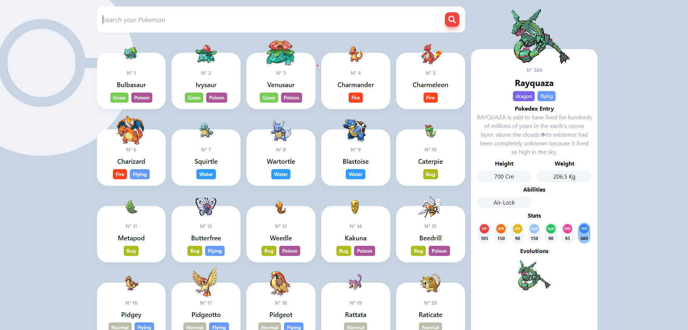

# React + Vite

#POKEDEX

 

  

 
 

## LIVE DEMO: https://pokedex-jordifsm.netlify.app/
 
This template provides a minimal setup to get React working in Vite with HMR and some ESLint rules.

Currently, two official plugins are available:

Description
This project is a Pokédex created using React with Tailwind CSS, utilizing the PokéAPI. It features lazy loading, filtered searches, sorting based on the API, and more.

Code scaffolding
You can generate new components using various libraries and tools available for React. For example, to generate a new component, you can use npx with libraries like create-react-component, generate-react-component, or similar.

Installation
After cloning the repository, navigate to the project directory and run the following command to install dependencies, run 'npm i'. This will install all the necessary packages and dependencies required for the project to run smoothly.

Development server
To start the development server, run 'npm run dev'. This will launch the application in development mode. Navigate to http://localhost:3000/ to view it in the browser. The page will automatically reload if you make edits to the source code.

Build
To build the project for production, run 'npx vite build'. This command bundles the app into static files for deployment. The build artifacts will be stored in the build/ directory.

Running tests
To execute unit tests, run 'npm test'. This command launches the test runner in interactive watch mode. You can write your tests using libraries like Jest and React Testing Library.

Further help
For more information about Create React App and its usage, you can refer to the official documentation.
